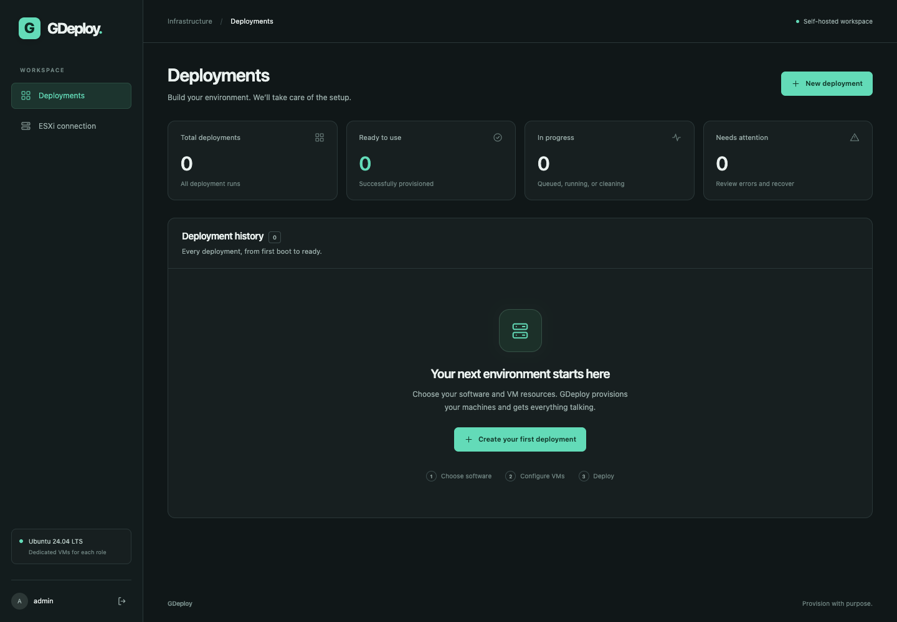

# GDeploy

A dark, Docker-hosted control panel that creates VMs on **standalone VMware ESXi 8.0 Update 3**, installs the operating system from your selected OS ISO, and installs selected applications. Splunk, Elasticsearch, Kibana and Corelight FleetManager each receive their own VM. Kibana connects to Elasticsearch using a service account token and verified TLS; Splunk and FleetManager run independently.

**Supported installer:** Ubuntu Server **24.04 LTS amd64 live-server** installation media. The generic OS ISO labels do not add support for other installers. GDeploy supports one administrator, one ESXi host and one VM per selected role per deployment. This is implementation-ready lab software; real ESXi deployment must be validated with your host, license, installation media and network before relying on it for production.

## Run on Ubuntu 24.04

Install Git and Docker on your Ubuntu Server 24.04 host. If Git and Docker with Compose already work, skip this block:

```sh
sudo apt update
sudo apt install -y git docker.io docker-compose-v2 docker-buildx
sudo systemctl enable --now docker
```

Clone the public repository, build the image and start GDeploy:

```sh
cd ~
git clone https://github.com/DasFunfZigste/GDeploy.git
cd GDeploy
sudo docker compose up -d --build --wait
```

Open **`http://YOUR_SERVER_IP:8000`** using the Ubuntu server's LAN address. On a fresh installation, sign in with **`admin` / `admin`**, change the credentials when prompted, then sign in again and open **Setup**. Configure the ESXi connection and OS installation media before creating a deployment.

This builds from the current default branch. No GitHub credential linking, Docker registry login or initial `.env` file is required. LAN access is enabled by default on `0.0.0.0:8000`.

To update for testing, use the **same clone**:

```sh
cd ~/GDeploy
git pull --ff-only
sudo docker compose up -d --build --wait
```

The rebuild preserves the existing data volume, account, settings and history. Keep your `.env` and `media/` directory, then refresh the browser. See the [short installation guide](docs/INSTALL.md) or the [operations reference](docs/OPERATIONS.md) for logs, network settings, backups and recovery.

## Included

- A guided form that starts with no software selected, then gives every selected VM its own name, vCPUs, RAM, disk, datastore, port group and DHCP/static IPv4 settings. Optionally deploy as soon as preflight passes; manual deployment remains the default.
- A **Setup** section with **ESXi connection**, **OS installation media**, **Software packages** and **SSH access** tabs. Choose an ISO from an ESXi datastore, upload it through the browser, or select it from the GDeploy server's media directory. Optionally save your SSH public keys for the `gdeploy` user on future VMs.
- Upload or select a licensed Splunk Enterprise `.tgz` in Setup, verify its publisher checksum, and manage unused uploads without editing environment files. Package-related preflight failures link to Setup while retaining the deployment draft.
- Configure **FleetManager** in its deployment-wizard step after **Configure VMs**, using an online Corelight repository token or offline `.deb` packages, a shared community string and the product identity PEM license. Online mode lists repository versions before preflight, with **Latest available** or an exact version to select. Setup also keeps its defaults and package-management controls. The [FleetManager walkthrough](docs/FLEETMANAGER.md) covers both modes and the first sign-in.
- An optional **OS only** VM alongside the application roles.
- Media checksum, inventory, name, capacity and network-input checks before provisioning.
- Save a default port group for the configured ESXi host in Setup. New VM forms use it, and each VM can override it; otherwise choose a port group explicitly.
- Retrieve, inspect and explicitly trust an ESXi certificate from Setup, with no container restart.
- Unattended Ubuntu installation using a remastered, bootable ISO and NoCloud autoinstall configuration.
- Unique generated guest/application credentials, encrypted storage and an explicit **Credentials** view in every deployment.
- Stage progress, persisted events and expandable deployment logs with sanitized error details. **Copy logs** supports HTTP LAN access and offers full-text manual copying if the browser blocks automatic copying. Interrupted work is identified on restart.
- Reversible history hiding for finished and stopped jobs, with a separate **Deployments → Previous deployments** view and **Restore**. VMs, logs and credentials remain available.
- Stop queued or running deployments while preserving created VMs, disks, credentials and logs. Running jobs acknowledge the stop at a safe boundary; existing guest operations may finish and stopped jobs do not resume automatically.
- Data-filesystem capacity and saved ISO usage in Setup, with protected deletion of unused uploaded or ESXi-imported copies.
- Failed-deployment **delete & redeploy**, with typed confirmation and strict resource ownership checks.
- Web-app authentication, required replacement of default sign-in credentials, expiring sessions, CSRF protection and sign-in throttling.
- An expandable **Preview** section below **Deployments**, listing **Alma Linux** and **Proxmox** as planned future work. These are reminders; they are not deployment options yet.

Saved deployment profiles are outside this initial scope.



## Releases

Open [GitHub Releases](https://github.com/DasFunfZigste/GDeploy/releases/latest) for the current version, changelog, exact Docker image digest, downloadable deployment bundle and Docker image archive. Each release page includes the complete installation walkthrough.

The current iteration is **v0.13.0**, with image reference `ghcr.io/dasfunfzigste/gdeploy:0.13.0` for `linux/amd64`. The repository and release downloads are public. GHCR package visibility is separate; use the source build above or the [optional downloadable image archive](docs/OPERATIONS.md#optional-release-image-archive) without a registry login. Historical release notes and tags remain unchanged.

See [CHANGELOG.md](CHANGELOG.md) for version history and [RELEASING.md](docs/RELEASING.md) for the repeatable release process.

## Prepare installation media and deploy

1. Use a Docker host that can reach both ESXi and the guest network. Allow space for the OS ISO and several GiB more for temporary installation media.
2. Open **Setup**, select the **ESXi connection** tab, and enter your ESXi hostname or IP. If its certificate is not already trusted, retrieve it, compare its SHA-256 fingerprint against a trusted ESXi source, and select **Trust certificate**. Then save your ESXi username/password and test the connection to load inventory. In **Default port group**, choose the network for new VMs and save it. Each VM can override this choice; without a valid default you must select a port group in its form.
3. Select the **OS installation media** tab at the top of Setup. Choose **ESXi datastore** to browse your saved host's datastores and folders for an existing ISO, upload the supported live-server ISO from your computer, or select a `.iso` file from the GDeploy server's `media/` directory. Enter its publisher's verified **SHA-256 checksum**, then save the selection. ESXi ISOs are copied to GDeploy for verification and unattended-install preparation; the original datastore file is kept unchanged. Browser uploads and ESXi copies persist in `/data/media`; server files use the read-only `/media` mount. No environment edit or container restart is needed. Copying and hashing a large ISO can take several minutes.
4. For Splunk, open **Setup → Software packages**. Upload your licensed **Splunk Enterprise Linux x86_64 `.tgz`**, or choose **GDeploy server** to select a `.tgz` already in `media/`; its vendor filename can remain unchanged. Enter the publisher's **SHA-512 checksum** (128 hexadecimal characters), or an existing verified **SHA-256 checksum** (64 characters), then select **Upload & use package** or **Use selected package**. Splunk supplies SHA-512 at the installer's official download URL with `.sha512` appended; the [package walkthrough](docs/OPERATIONS.md#configure-the-splunk-package) explains where to copy it. GDeploy calculates and verifies the checksum for you, validates the archive and saves the choice without an environment edit or container restart. It does not download Splunk or supply a license. Server-mounted files must be readable by container UID 10001: use directory mode 0755 and file mode 0644, or equivalent ACLs. Keep secrets out of `media/`.
5. Select **New deployment**, give the deployment a label and choose at least one application role; a fresh wizard has none selected. In **Configure VMs**, fill in the separate section for each role: its VM name, CPU, RAM, disk, datastore, port group and network settings. Selecting Elasticsearch and Kibana displays two VM sections; the deployment label does not replace either VM name. FleetManager defaults to 2 vCPUs, 8 GiB RAM and an 80 GiB disk.
6. If FleetManager is selected, the next step is **FleetManager configuration**. Choose **Online repository** or **Offline package**, and supply or reuse the saved community string and product identity `.pem`. Online mode needs the Corelight customer repository token. Select **Load versions** using an entered or saved token, then choose **Latest available** or an exact version from **Version to install** before selecting **Save & continue**. Loading choices does not save changes; lookup errors retain your selected version. Each queued job keeps its choice. Offline mode needs a `corelight-fleet` amd64 `.deb` and any missing dependency packages; it does not fetch repository packages. Setup remains available for defaults and package management. See the [FleetManager walkthrough](docs/FLEETMANAGER.md) for preparation and ISO requirements.
7. In **Review & deploy**, select **Run preflight**, review the results and deploy. For immediate deployment after successful checks, first check **Start deployment automatically when preflight passes**, then select **Run preflight & deploy**. This option starts unchecked; failed checks stop the process. Saving FleetManager configuration alone does not start a job. Deployments without FleetManager go directly from **Configure VMs** to **Review & deploy**, retaining the three-step wizard. Open the resulting deployment for progress, logs, endpoints and **Credentials**.

ESXi imports and browser uploads support ISOs up to **16 GiB**. The GDeploy host needs room for the retained local copy plus temporary remastering space. Datastore browsing requires `Datastore.Browse` and permission to download the selected file, using the saved ESXi account and certificate trust.

The saved OS ISO and checksum are used for future deployments. Each queued deployment retains its selected local ISO and checksum, so later Setup changes do not switch its source media. Keep that local file available and unchanged until the deployment finishes. An imported ESXi copy can be reused without downloading the original again; changes to the original after a completed import do not change that copy. Existing environment configuration still works when no selection has been saved in Setup: use `GDEPLOY_OS_ISO` and `GDEPLOY_OS_SHA256`, or the compatible legacy `GDEPLOY_UBUNTU_ISO` and `GDEPLOY_UBUNTU_SHA256` names.

Splunk uploads accept packages up to **4 GiB** and persist in `/data/packages`. Each new Splunk job captures its package choice so later Setup edits cannot switch it. If preflight reports a missing package, select **Configure Splunk package**, finish Setup, then **Return to deployment** and rerun preflight; the VM choices are kept in the open browser's draft. Existing environment package settings remain a fallback when no choice is saved. See the [Splunk package walkthrough](docs/OPERATIONS.md#configure-the-splunk-package) for selection, cleanup and legacy configuration.

Use the update commands at the top of this README from your existing clone. Optional environment-file credentials, network restrictions, plain Docker and release-image loading are covered in the [operations reference](docs/OPERATIONS.md).

## ESXi and network preparation

- Use a standalone ESXi 8.0 U3 endpoint. vCenter, distributed switches and clusters are outside this release.
- The ESXi account needs permission to read inventory, create/configure/power/delete VMs, allocate datastore space and manage the deployment's ISO files. Selecting existing ESXi media also requires `Datastore.Browse` and file download access. ESXi licensing must permit provisioning through the vSphere API. Inventory checks prove authentication and read access; actual deployment operations validate write privileges and license capabilities.
- The app connects to ESXi over HTTPS **443** for API operations and datastore downloads/uploads. It verifies the certificate using the exact certificate you approved for that endpoint, or normal system/private CA trust when no certificate is approved.
- The app must reach guests on SSH **22**. Ordinary installations need DNS and HTTPS/HTTP access to Ubuntu mirrors; Elastic roles also need the official Elastic package repository. Online FleetManager additionally needs `pkgrepos.corelight.cloud` and its HTTPS download destinations (which can be CloudFront): the GDeploy container uses them for version choices and the guest uses them for installation. The guest still verifies availability and packages through signed apt. Offline FleetManager uses the regular Ubuntu live-server ISO and supplied `.deb` dependencies without repository downloads; this mode applies only to its own VM.
- Kibana must reach Elasticsearch on HTTPS **9200**. Your browser needs access to Kibana **5601** and Splunk Web **8000**. Splunk's local verification uses its management API on **8089**. GDeploy does not configure your network firewall or switch.
- FleetManager uses HTTPS **443** for administrators and TCP **1443** from Corelight sensor management interfaces. Sensor enrollment is performed later in Fleet Manager.
- Use static addresses or DHCP reservations for application VMs. Elasticsearch's certificate and Kibana's configuration use the assigned Elasticsearch IP; a later DHCP address change requires reconfiguration.
- Static networking takes an IPv4 CIDR address, gateway and DNS servers. Preflight checks syntax and in-app reservations; it cannot guarantee an address is unused elsewhere on your LAN.
- ESXi and guest time should be synchronized for TLS.

### Trust an ESXi certificate in the app

In **Setup → ESXi connection**, retrieve the certificate for the entered host. Review its subject, issuer, validity dates, DNS/IP names and **SHA-256 fingerprint**. Compare that fingerprint with the certificate shown through a trusted ESXi management session before selecting **Trust certificate**; retrieving a certificate alone does not establish the host's identity. Save the connection credentials and test the connection.

The approval is stored in the app database for that exact host/IP and survives restarts. API connections and datastore downloads/uploads require the approved certificate and valid dates. A changed or renewed certificate must be retrieved, reviewed and trusted again. Explicit approval also supports an ESXi IP address that is absent from the certificate's DNS/IP names. Removing trust in the same screen restores normal system/private CA verification. No CA file, environment edit or restart is needed for this workflow.

As an optional alternative for a private CA, make a PEM bundle containing the normal public roots plus that CA and mount it read-only (for example under `/media/esxi-ca-bundle.pem`). Set both `SSL_CERT_FILE=/media/esxi-ca-bundle.pem` and `REQUESTS_CA_BUNDLE=/media/esxi-ca-bundle.pem` in `.env`, then recreate the container. This allows the Python SOAP client and HTTPS file transfers to validate the same certificate chain and hostname. Do not commit private keys.

## Credentials and application behavior

- Open **Setup → SSH access** to save one or multiple OpenSSH public keys, one per line. GDeploy installs the saved keys for the `gdeploy` user on every VM in newly queued deployments, alongside its separate automation key. You can review fingerprints and edit or clear the saved list. Ed25519, RSA (2048 bits or larger) and ECDSA are supported, with up to 50 keys; duplicate key material is saved once. Keep private keys on your own workstation. See the [SSH setup instructions](docs/OPERATIONS.md#configure-ssh-access-for-new-vms) for key creation and login examples.
- Each queued deployment captures its key list. Later Setup edits do not change queued jobs or existing VMs, and removing a saved key does not revoke access on an existing VM. A new delete-and-redeploy job uses the latest saved keys. Older queued jobs with no saved-key snapshot keep their original automation key only.
- The chosen web-app username and password hash are stored in the database and survive container rebuilds. The initial `bootstrap-credentials.txt` is not updated after account setup; save your chosen credentials in your password manager. Account setup leaves the encryption key and bootstrap/environment files unchanged.
- Each VM receives the OS administrator **`gdeploy`**, a different random password, and a separate automation SSH key. VM names remain hostnames; they are not passwords.
- New OS, Elasticsearch/Kibana and Splunk login passwords use 40 random characters without common letter/number lookalikes or punctuation. Existing and already queued passwords remain valid; the change does not restrict passwords you enter yourself. FleetManager's temporary administrator password is generated by the vendor.
- Open a deployment and select **Reveal credentials** to see the exact VM username/password, IP, SSH host key, application URL and application credentials. Reveals are recorded in the deployment events. The browser conceals the panel automatically after one minute and when navigating away. Copying a value leaves it in your operating-system clipboard until replaced.
- ESXi credentials, guest passwords, SSH private keys and application secrets are encrypted using a persistent key. Automatic installations keep it in `/data/bootstrap.json` inside the data volume; manually configured installations use `.env`. Back up the data volume, including `bootstrap.json`, and any existing environment files; losing the original key prevents decryption. Application administrators can intentionally reveal deployment passwords.
- Splunk receives its own `admin` password. Selecting Splunk requires explicit acceptance of its software license. License activation beyond the supplied package's initial behavior is a separate administration step.
- FleetManager receives a vendor-generated temporary **`admin`** password in **Credentials**; change it at first sign-in. Setup secrets and the product identity PEM are encrypted, while responses show saved-state flags and license metadata. Editing Setup does not rotate values or upgrade software on an existing FleetManager VM.
- Elasticsearch is a single-node install from the official **9.x** apt repository. Kibana uses the exact installed Elasticsearch package version. Both packages are held to prevent uncoordinated upgrades. Plan upgrades and backups separately.
- Elasticsearch uses a deployment CA; Kibana verifies that CA and uses a dedicated Elastic service token. Initial interactive Kibana and Elasticsearch sign-in uses the generated `elastic` administrator credentials. Create narrower application users for ongoing use.
- Splunk and Elastic browser endpoints use generated certificates. Trust the appropriate certificates through your normal administration process, or replace them with your organization's certificates. The generated service certificates expire after 825 days; the Elasticsearch CA expires after 10 years. FleetManager initially uses the supplied product identity certificate; configure a suitable browser certificate through Corelight's supported procedure.
- First SSH contact uses trust on first use over your managed guest network. The observed key is persisted and required for later connections. This is not a substitute for a trusted provisioning network.

## Failure recovery

To remove a finished or stopped record from the main **Deployment history**, select **Hide** in its row or **Hide from Deployments** on its detail page. Click **Deployments** in the sidebar to reveal **Previous deployments** underneath it. That separate view contains hidden records; select **Restore** to move one back to the main list. Direct links still open hidden deployment details. Queued, running, stopping and cleaning work cannot be hidden; a stop request must finish before Hide becomes available.

Hiding preserves the VMs, original job status, logs, credentials and resource reservations. It does not complete failed checks, resume provisioning or remove attached installation media. If a VM is healthy but its deployment record failed a readiness check, you can keep that VM and hide the record. Inspect the guest and logs before deciding whether any unfinished work needs attention.

Version **0.7.1** repairs two cloud-init readiness failures: stderr warnings no longer corrupt JSON status parsing, and Ubuntu's clean `disabled-by-marker-file` state can pass when independent first-boot, installer, root-filesystem, sudo, SSH and VMware Tools checks confirm readiness. Reported cloud-init errors still block progress. Transient first-boot states receive bounded retries, with sanitized details in **Deployment logs**. The fix uses the same verified OS ISO; no replacement upload is needed for `ubuntu-24.04.5-live-server-amd64.iso`.

Updating does not resume an already failed deployment or change its recorded status. Preserve a working VM and review any unfinished software installation or media cleanup separately. The [readiness troubleshooting guide](docs/OPERATIONS.md#check-ubuntu-readiness-after-a-deployment-error) explains what follows the OS check and how to inspect an existing guest.

Use **Stop deployment** to stop queued or running work. A queued job stops immediately. A running job shows **Stopping** until the current operation reaches a safe boundary, then **Stopped**. GDeploy skips later stages and VMs, retains credentials and logs, and leaves created VMs and disks in place. OS installation already running inside a VM can continue. Stopping does not power off VMs, undo installed software or provide automatic resume. See [stopping a deployment](docs/OPERATIONS.md#stop-a-deployment) for details.

When a stage fails, select **View deployment logs** in its error banner, or **View logs** in the **Deployment logs** card. Select **Copy logs** to copy the sanitized diagnostics, including over HTTP LAN access. If the browser blocks automatic copying, use Ctrl+C (⌘C on Mac) on the selected **Full deployment log**, then **Done copying**. Older entries can show only the detail recorded at the time. Check the ESXi console before selecting **Delete & redeploy**. Type the deployment name to confirm permanent deletion of that deployment's VMs and virtual disks, including any data already written. A fresh deployment uses the saved VM choices, the current OS ISO selection and new credentials.

Version 0.5.0 fixes media preparation when extracted GRUB/manifest files retain read-only permissions, and places that work's temporary files under `/data/artifacts`. It modifies only private working files. If preparation still fails, use the expanded logs to distinguish permissions, storage, source-media and tool errors; the ISO filename or an older generic error cannot identify the cause alone.

Cleanup verifies both the deployment UUID annotation and datastore paths before deleting a VM. It discovers tagged VMs even if the app stopped before recording their IDs. Shared datastores, networks, source media and unrelated VMs are retained. Manually moving a disk outside its deployment directory causes cleanup to stop for inspection. If deletion fails, no replacement is started; retry after fixing the cause. If cleanup succeeds but the new preflight fails, the error still appears under delete/redeploy and a later retry is safe.

A timed-out ESXi operation can still be running on the host. Inspect its tasks before retrying. OS installation has a configurable one-hour limit (`GDEPLOY_OS_TIMEOUT`); software stages also use bounded waits.

## Persistence and operation

The Compose data volume mounted at `/data` contains the SQLite administrator account, approved ESXi certificates, saved OS ISO/package selections and history, encrypted secrets and FleetManager licenses, uploaded/imported ISOs under `/data/media`, uploaded Splunk packages under `/data/packages`, FleetManager/dependency uploads under `/data/fleetmanager-packages`, and temporary media work. Automatic installations also keep `bootstrap.json` and the initial `bootstrap-credentials.txt` there. Source Compose normally names the volume `gdeploy_gdeploy-data`; the release bundle defaults to `gdeploy-data`. GDeploy removes its deployment-specific installation ISO from the datastore after the OS is ready. Original ESXi source ISOs and server files in `media/` are never modified or deleted by that cleanup. Deployment history is retained after cleanup.

Open **Setup → OS installation media → Storage & saved ISOs** to check capacity and remove unused copies. The displayed capacity belongs to the filesystem backing `/data` as seen inside the container; it is not a whole-host disk inventory. The default volume has no GDeploy storage quota and uses available space on that filesystem. The separate 256 MiB `/tmp` mount is not the ISO workspace limit. You can also check with `docker compose exec gdeploy df -h /data /tmp`.

Select **Delete** beside an unused upload or ESXi copy, then confirm **Delete ISO**. Selected media and files referenced by queued, running, stopping or cleaning deployments are protected. To remove the current default, select **Clear saved selection** or choose another ISO first. Clearing does not delete the file; existing environment media settings become the fallback. This lets you clear and delete your only unused copy without needing room for a replacement upload. Active deployments keep their original source and protection. Deletion removes only GDeploy's saved copy and leaves original ESXi files and the read-only server media mount untouched. The [storage walkthrough](docs/OPERATIONS.md#manage-storage-and-saved-isos) explains capacity limits, cleanup and expanding the backing storage when needed.

Manage uploaded Splunk packages in **Setup → Software packages**. Clear the saved default or select another package before deleting an unused upload, then confirm **Delete package**. Active-job references remain protected even after clearing the default. Server-mounted packages remain outside the app's deletion controls; package deletion does not uninstall Splunk from an existing VM.

FleetManager has its own **Clear FleetManager setup** and package deletion controls. Clearing removes defaults and secrets for future deployments while retaining uploaded files and queued snapshots. Selected or queued/running/stopping/cleaning package files remain protected from deletion. Back up the complete volume and original encryption key, plus separately mounted `.deb` files and your vendor license records.

Run **one app container with one worker** against a data volume. Jobs are serialized; this release does not support multiple replicas. The container runs without root privileges or Linux capabilities, with a read-only root filesystem. Stop the app before taking a consistent backup of its complete data volume, including automatic bootstrap files, and any existing `.env`/`docker.env`. Store your chosen web-app credentials in your password manager; the private bootstrap credentials file is not a substitute for a backup. Do not use `docker compose down -v` unless you intend to erase the app's database and credentials.

## Development and validation

```sh
python3.12 -m venv .venv
. .venv/bin/activate
pip install -r requirements.lock
pip install -e '.[test]'
pytest -q
ruff check .
```

Backend tests cover sign-in/CSRF, secret redaction and encryption, recovery, topology validation, media generation, VMware task failures and ownership boundaries. Guest scripts are syntax-checked and VMware configuration uses the real SDK types in tests. GitHub CI runs the test suite and builds/smoke-tests the Docker image. Mocked tests cannot prove firmware boot, unattended installation, ESXi licensing, networking or package behavior on your host; use the [lab acceptance checklist](docs/LAB_VALIDATION.md) before the first real workload.

Architecture: FastAPI serves the same-origin static interface; SQLite persists jobs/events and encrypted secrets; one background worker uses pyVmomi for ESXi and SSH for Ubuntu/application setup. See [architecture notes](docs/ARCHITECTURE.md).
