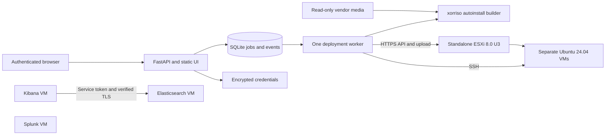

# Architecture

Deployment stages: queued → preflight → preparing media → creating VM → installing OS → installing software → verifying → completed. An exception moves the job to failed and preserves its error/events. Shutdown during work becomes interrupted on restart. Queued jobs survive restart; running jobs are deliberately not resumed because an external operation may have completed without a local acknowledgment.

The specification, generated credentials and ESXi connection snapshot are saved before provisioning. The remote ISO path is recorded before upload. A VM receives its UUID ownership annotation atomically as part of creation; cleanup can discover that annotation if a crash precedes saving the managed-object ID. Each mutation persists relevant state before moving to the next stage.

Recovery: failed/interrupted → cleaning → reverted + new queued deployment. A cleanup or replacement-preflight error becomes cleanup_failed and can be retried. Cleanup only deletes tagged VMs with deployment-owned storage and explicitly recorded ISO paths. It never deletes a datastore or network.

The app is a single-administrator tool. Auth uses scrypt password hashes, random server-side sessions with hashed cookie identifiers, SameSite/HttpOnly cookies and CSRF tokens. Secrets use authenticated Fernet encryption; ordinary API responses omit secrets. The encryption key is external to the database. Credential reveals are POST requests with CSRF verification, no-store headers and an audit event.

The HTTPS deployment connection snapshot is encrypted with each job so changing Settings does not redirect existing work or recovery to a different ESXi host. Changed credentials for the same host may require operator intervention if an old job's snapshot is no longer valid.

An actual host/guest lab is required to establish integration compatibility. No simulated deployment mode is exposed to users, and production success is only reported after OS and application checks return successfully.
