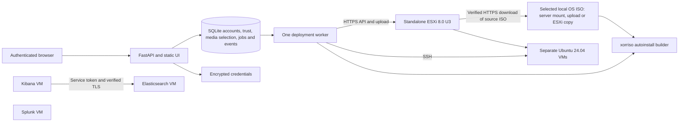

# Architecture

Deployment stages: queued → preflight → preparing media → creating VM → installing OS → installing software → verifying → completed. An exception moves the job to failed and preserves its error/events. Shutdown during work becomes interrupted on restart. Queued jobs survive restart; running jobs are deliberately not resumed because an external operation may have completed without a local acknowledgment.

The deployment detail page exposes an expandable, copyable log view. Diagnostic text is sanitized before persistence/presentation, and media-preparation failures retain bounded tool output where available. Existing entries contain only the information originally saved; a later release cannot reconstruct discarded diagnostics.

Deployment history visibility is persistent metadata in an additive `hidden_at` database column, separate from provisioning status. Administrators can hide terminal records from the default list and include them again with **Show hidden**, or restore their normal visibility. Direct detail access, logs, encrypted credentials, VM ownership and resource reservations remain intact. Visibility updates require authentication, completed account setup and CSRF protection; queued/running/cleaning jobs cannot be hidden. Hiding performs no ESXi operations, does not retry or complete failed checks, and leaves cleanup/recovery decisions unchanged. Older releases use positional deployment inserts and cannot create jobs against this expanded schema; rollback requires the matching pre-upgrade data-volume backup.

The specification, generated credentials, ESXi connection snapshot and selected OS ISO path/checksum are saved before provisioning. The remote ISO path is recorded before upload. A VM receives its UUID ownership annotation atomically as part of creation; cleanup can discover that annotation if a crash precedes saving the managed-object ID. Each mutation persists relevant state before moving to the next stage.

The deployment wizard renders a separate configuration section for every selected role, all visible together. Each maps to its own existing VM specification containing name, CPU, RAM, disk, datastore, port group and IP configuration. The deployment name labels the group. Kibana requires a separate Elasticsearch VM; selecting the pair does not combine their settings or resources. This presentation change preserves the existing per-VM API format and provisioning flow.

Recovery: failed/interrupted → cleaning → reverted + new queued deployment. A cleanup or replacement-preflight error becomes cleanup_failed and can be retried. Cleanup only deletes tagged VMs with deployment-owned storage and explicitly recorded ISO paths. It never deletes a datastore or network.

The app is a single-administrator tool. Auth uses scrypt password hashes, random server-side sessions with hashed cookie identifiers, SameSite/HttpOnly cookies and CSRF tokens. Secrets use authenticated Fernet encryption; ordinary API responses omit secrets. The encryption key is external to the database. Credential reveals are POST requests with CSRF verification, no-store headers and an audit event.

The HTTPS deployment connection snapshot is encrypted with each job so changing Setup does not redirect existing work or recovery to a different ESXi host. Changed credentials for the same host may require operator intervention if an old job's snapshot is no longer valid.

Setup groups ESXi connection and OS installation media in separate tabs. The media tab is directly addressable at `#settings/media` and opens by default when the host is configured but no ISO is ready. Administrators can browse the saved ESXi host's datastores and folders for an existing ISO, select an existing `.iso` from the read-only `/media` server mount, or stream a browser upload. Browser uploads and ESXi downloads are stored in `/data/media` in the persistent data volume. The administrator supplies the publisher's verified SHA-256; GDeploy checks it before saving the selection. Failed validation retains the previous selection. Authentication, completed account setup and CSRF protection are required for media mutations.

ESXi browsing and downloads use the saved standalone-host credentials and the same certificate verification as provisioning. A browse selection is bound to its host so changing the saved endpoint requires a fresh selection. Datastore browsing requires `Datastore.Browse` and download access to the selected file. Downloads are bounded to 16 GiB and checked against available local disk capacity. GDeploy saves a local working copy and its origin host/datastore/path with `source="esxi"`; the original datastore file is not modified or deleted. The local copy is retained for later deployments and survives restarts. The existing Ubuntu autoinstall builder remasters that copy into each deployment's separate installation ISO.

The saved media selection takes precedence over environment-configured media. `GDEPLOY_OS_ISO` and `GDEPLOY_OS_SHA256` are the preferred environment names; the legacy `GDEPLOY_UBUNTU_ISO` and `GDEPLOY_UBUNTU_SHA256` names remain compatible. Existing installations use the environment fallback until an administrator saves a selection in Setup. **Clear saved selection** removes that default without deleting the source file, restores the environment fallback when configured, and leaves active deployment snapshots and deletion protection intact. This permits clearing and then deleting a sole unused managed copy without first uploading another. Uploaded/imported media belongs in the complete data-volume backup; server-mounted source media is backed up separately.

New jobs snapshot the selected local ISO path and checksum so later Setup changes cannot switch media for queued or running work. They still require the local source file to remain available and unchanged. Once an ESXi import finishes, subsequent changes to the original datastore file do not alter its saved copy. Delete/redeploy makes a new job using the current media selection. The UI's generic OS ISO labels describe media selection; the autoinstall builder and guest configuration still support only Ubuntu Server 24.04 LTS amd64 live-server media.

Storage reporting uses the filesystem containing the configured data directory, normally `/data`, as seen by the container. It reports that filesystem's total, used and available bytes alongside sizes of managed ISO copies and deployment work. It does not enumerate unmounted host disks, impose a data-volume quota, or resize the host filesystem. The default named volume uses the backing filesystem's available capacity; the separate `/tmp` tmpfs remains limited to 256 MiB.

The installer writes temporary files beneath its private workspace in `/data/artifacts` and supplies that directory as subprocess `TMPDIR`. Extracted GRUB and manifest files can preserve the ISO's read-only mode, so the builder makes those private working copies writable before patching. The selected source ISO remains unchanged. This work runs as the existing non-root container account and uses disk-backed data storage rather than the small `/tmp` mount.

Authenticated administrators can delete registered browser-uploaded or ESXi-imported ISO copies. Deletion is checked against the current selection and queued/running/cleaning deployment snapshots, and serialized with selection and deployment insertion. It refuses protected files and does not follow replacement symlinks or arbitrary paths. It removes only an eligible managed copy and its registry entry, records an audit event, and leaves deployment history intact. Server-mounted sources and original ESXi files are outside this API. A missing unprotected managed file can have its stale registration removed without touching unrelated files.

ESXi certificate retrieval returns the peer certificate's subject, issuer, SHA-256 fingerprint, validity dates and subject alternative names for operator review. The administrator explicitly approves the certificate for that exact host endpoint after comparing its fingerprint with an independently trusted ESXi source. The fetched certificate by itself is not proof of host identity.

Approved certificates are persisted in an additive SQLite trust table. Each new ESXi client looks up the current approval for the endpoint it will connect to, including the host saved in an older deployment snapshot. Certificate approvals are not copied into deployment snapshots. Both the API transport and datastore HTTPS downloads/uploads enforce the exact approved leaf certificate and its valid dates on their connections. Endpoint-specific approval permits a hostname/SAN mismatch; without an approval, normal system/private CA and hostname verification applies. A changed or renewed certificate requires explicit review and replacement of the approval.

Trust removal restores CA-based verification. Trust updates affect subsequent connections; existing authenticated connections may finish with their already-verified certificate. Container restart is unnecessary, and approved certificates survive restart in the same app data volume. Backups must include the trust table. Application versions before **0.2.0** ignore the table and use their previous TLS settings, which can include a saved `verify_tls=false`. Before rollback, review those settings and ensure certificate verification is enabled and trusts the intended host.

An actual host/guest lab is required to establish integration compatibility. No simulated deployment mode is exposed to users, and production success is only reported after OS and application checks return successfully.
